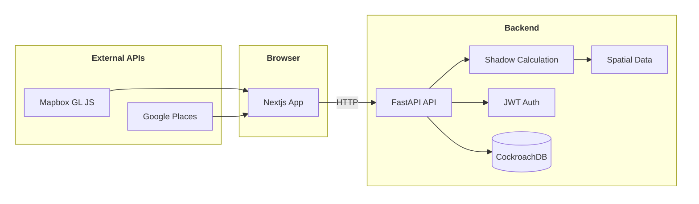

## 系統架構

前端以 React / Next.js 在瀏覽器執行，透過 HTTP 呼叫後端 FastAPI；地圖渲染與地址搜尋則直接連線外部服務。後端負責建物查詢、陰影計算與會員 API，並以 asyncpg 存取 CockroachDB。

<div className="chart-hint">
  <span className="chart-hint__icon" aria-hidden="true">i</span>
  <p>圖表較大時，請使用右下角的<strong>縮放與方向鍵</strong>瀏覽。箭頭表示主要資料或請求流向。</p>
</div>



| 元件 | 說明 |
|------|------|
| Nextjs App | React / Next.js 前端應用 |
| Mapbox GL JS | 3D 建物渲染、陰影圖層、地形 |
| Google Places | 地址自動完成（Google Places API） |
| FastAPI API | 後端 API 路由（`main.py`） |
| Shadow Calculation | pvlib NREL SPA（太陽方位角、仰角）+ Shapely / pyproj（陰影多邊形） |
| Spatial Data | GBA 建物（約 190 萬棟）與 DEM 地形（20 m 到 100 m） |
| JWT Auth | JWT + bcrypt，會員與廠商登入 |
| CockroachDB | 透過 asyncpg 存取主要資料表 |

## 前端結構

| 目錄 | 說明 |
|------|------|
| `src/app/` | Next.js App Router 入口、layout、vendor/admin 頁面 |
| `src/screens/` | 評估 wizard 各步驟（Landing、Address、Usage、Goal、Params、Results） |
| `src/components/` | MapView、AuthModal、HistoryDrawer 等共用元件 |
| `src/lib/compute.ts` | 核心試算邏輯（發電量、回本年限）— 純前端計算 |
| `src/lib/constants.ts` | 縣市補助、面板等級、日照資料 |

## 後端結構

| 檔案 | 說明 |
|------|------|
| `backend/main.py` | API 路由與 FastAPI app |
| `backend/shadow.py` | 陰影計算（pvlib + Shapely + DEM） |
| `backend/db.py` | 資料庫連線、GBA 建物查詢、快取 |
| `backend/auth.py` | JWT 與密碼雜湊 |
| `backend/dem_tiles.py` | DEM → Mapbox terrain-rgb tile server |

## 資料庫主要資料表

| 資料表 | 用途 |
|--------|------|
| `gba_buildings` | GBA 建物永久資料（約 190 萬棟） |
| `climate_annual` / `climate_monthly` | 鄉鎮市氣候資料（NASA POWER） |
| `shadow_cache` | 陰影預計算快取 |
| `assessments` | 使用者評估紀錄 |
| `accounts` | 會員帳號（user / vendor / admin） |
| `vendors` / `inquiries` | 廠商資料與詢價紀錄 |

詳細 schema 見專案內 `backend/DATABASE.md`。

## 建物資料來源優先序

1. **GBA 離線 DB**（CockroachDB `gba_buildings`）— 預設
2. **本地 fallback**（`taiwan_polygon_fallback.ndjson.gz`）— DB miss 時
3. **OSM Overpass API** — 最終備援

## 試算邏輯位置

發電量與財務試算在**前端**完成（`src/lib/compute.ts`），不需呼叫後端：

```
容量 = 屋頂坪數 × 3.3 m²/坪 × 可用比例 × 0.165 kW/m²
月發電量 = 容量 × 日照強度 × 天數 × 性能比 × 目標係數
年收益 = 自用省電 + 台電躉購
回本年限 = 實際自付 ÷ 年收益
```

後端主要負責建物查詢、陰影計算、氣候資料、會員與廠商 API。
