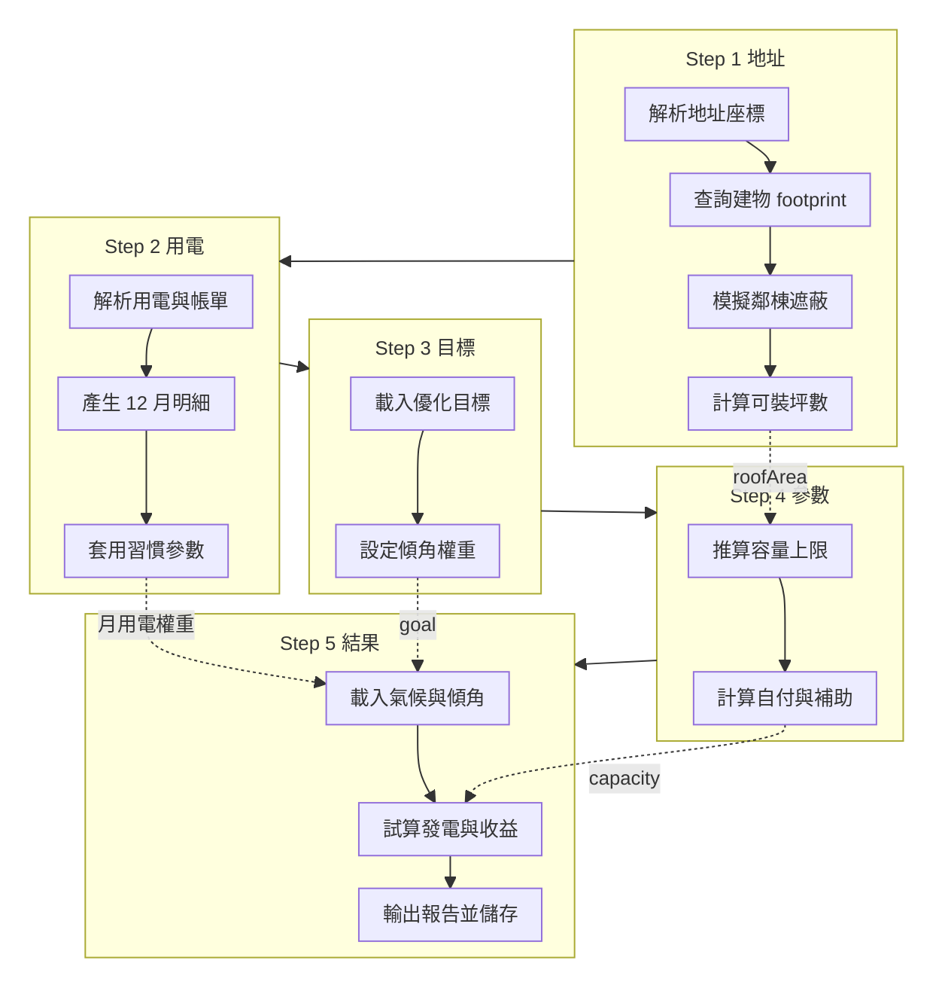
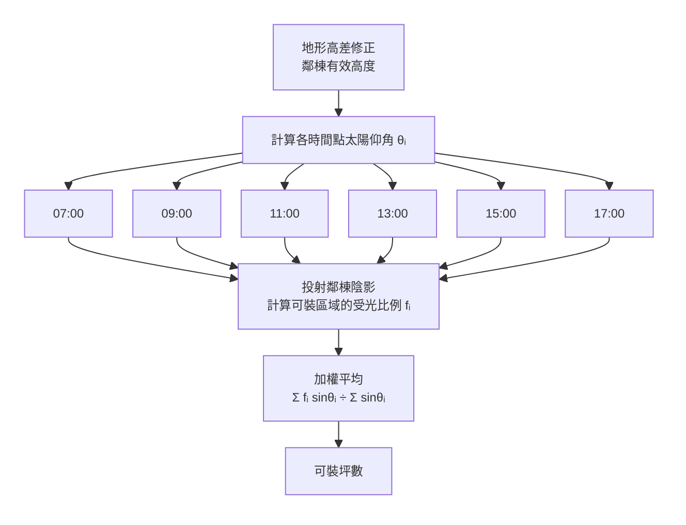
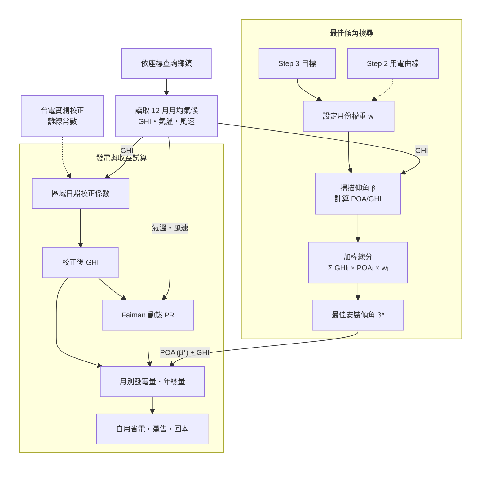

當使用者完成一次屋頂評估時，資料依序流經五個精靈步驟：地址、用電、目標、參數、結果。其中地址與結果兩步會與後端 API 互動；中間三步在使用者填表時於瀏覽器內累積輸入，並推導出裝置容量與自付金額。最終的發電量、收益與回本年數在結果頁一次合併計算。

本頁依步驟說明地址評估管線的用途與處理邏輯，步驟之間的資料流動見總覽圖。端點欄位與請求格式請見 [API 參考](/developer-guide/api-reference)，陰影幾何細節請見 [陰影計算](/developer-guide/shadow-calculation)。

---

## 總覽：步驟之間的資料傳遞

下列總覽圖以**由上而下**排列五個獨立步驟框；框內節點描述**系統執行的處理**，虛線為跨步驟的資料傳遞。Step 1 接收使用者輸入的地址資訊，並計算出該建物可安裝太陽能板的面積，用於 Step 4 推算發電容量。
Step 2 與 Step 3 分別記錄使用者的用電習慣與發電目標，搭配 Step 4 計算出的發電量，於 Step 5 匯出推薦的面板安裝角度、對應的發電收益與其他投資試算指標。

**離線準備（評估前已完成）：** 全台建物圖資與行政區界等空間資料已預先匯入，供 Step 1 即時查詢。鄉鎮月均氣候、費率與補助常數在 Step 5 或 Step 4 試算時讀取。

---

## 離線準備：評估前的資料匯入

在任何人開啟評估之前，下列資料已透過批次作業備妥。使用者按下「下一步」時，系統讀取這些靜態資源，而非即時向外部下載全台圖資。

- **3D 建物模型** — 來自 [GlobalBuildingAtlas](https://github.com/zhu-xlab/GlobalBuildingAtlas)，用於辨識目標建物、計算屋頂面積與鄰棟陰影。
- **行政區界** — 來自內政部區界，將座標對應至鄉鎮，供後續氣候查詢。
- **鄉鎮月均氣候** — 來自 [NASA POWER](https://power.larc.nasa.gov/) 多年均值，覆蓋全台各鄉鎮十二個月，供結果步驟發電試算與地區分析使用。
- **地表高程** — 來自內政部 DEM，用於鄰棟有效遮蔽高度與地圖地形。
- **費率與補助常數** — 依政府公告與產品假設，供參數與結果步驟的成本收益試算。

---

## Step 1 · 地址

使用者輸入或點選地址後，系統必須釐清三個問題：座標在哪裡、對應哪一棟建物、以及鄰棟遮蔽下還有多少屋頂可裝板。此步完成後，可用屋頂坪數會鎖定，作為後續容量推算的上限。

- **地理編碼** — 將使用者從地圖或搜尋選定的地點轉成標準經緯度與可讀地址。座標是後續所有空間查詢與陰影模擬的共同起點，地圖也會同步飛至該點。
- **行政區對應** — 依座標判定所在的縣市與鄉鎮。此行政區資訊用來對應預先匯入的鄉鎮氣候資料；同一鄉鎮內的不同地址共用同一組長期月均日照與氣溫。
- **建物辨識** — 在地址周邊搜尋建物，選取屋頂多邊形確實涵蓋該座標的那一棟。若無法命中，流程停止並提示找不到建物，不會改用鄰近建物代替。建物資料優先來自離線匯入的全台圖資，必要時才回退到其他來源。
- **屋頂地坪** — 由選定建物的屋頂輪廓計算水平投影面積。此為尚未扣除遮蔽的總面積，代表理論上最大的屋頂範圍。實際上使用者能在此範圍內自行減少可用面積，以便扣除水塔、電表等基礎設施佔用的空間。
- **鄰棟遮蔽試算** — 抓取周邊建物與地形，模擬陽光被鄰房遮擋後，實際還能安裝太陽能板的區域比例。運算流程見下圖。

每個時點會先計算該時刻的太陽仰角 θᵢ，再以**已修正的鄰棟有效高度**投射陰影，得出可裝區域的受光比例 fᵢ。地形修正發生在投射之前：若鄰棟地坪低於目標屋頂，有效遮蔽高度會縮短甚至視為不遮蔽。加權時以 sin θᵢ 為權重，近似水平面日照強度，因此正午（θ 較大）權重最高，清晨與傍晚較低。這是**評估當日**六個時點的加權結果，**不是**全年逐月或逐日分開模擬——若評估日落在冬至前後，當日整體 θ 偏低、陰影較長，係數自然偏保守；夏至則相反。全年陰影變化被濃縮成這一次的加權係數，再一次性縮小可裝坪數。

- **鎖定可裝坪數** — 將地坪面積乘以遮蔽係數，得到這次評估可用的屋頂坪數上限，供後續容量與預算試算使用。
- **地圖陰影預覽** — 地圖上另有一條並行流程，讓使用者用時間滑桿檢視當日不同時刻的遮蔽情形。此圖層僅供理解現場狀況，**不參與**發電量與投資報酬的數字試算。

---

## Step 2 · 用電

此步蒐集與**自用比例**、**月別電費**相關的使用者資訊，全程在瀏覽器內完成，不呼叫後端。

- **用電資料整理** — 接受使用者填寫的月用電度數，或從雙月帳單金額反推用電量。大樓模式會一併考慮戶數，以便後續逐戶計算電費。
- **補齊十二個月** — 若使用者只提供部分月份的帳單，系統會依台電住宅的季節性用電型態，將已知月份拆解並補齊全年十二個月，避免試算時缺少淡季或旺季資訊。
- **用電習慣** — 記錄白天在家程度等習慣，用來估算無儲能系統時，發電有多少比例能在現場被自用掉。
- **傳遞至後續步驟** — 整理後的月別用電曲線，會在選擇「貼近用電」或「投資報酬」等目標時，作為傾角搜尋與收益試算的個人化權重依據。

---

## Step 3 · 目標

使用者選擇這套太陽能系統要優先達成什麼目的。此步本身不產生試算數字，但會改變結果步驟如何搜尋**最佳安裝傾角**，以及各月發電量的加權方式。

- **選定優化目標** — 常見目標包括最大化發電量、貼近自身用電曲線、提高投資報酬等。每種目標代表不同的月份權重與傾角評分邏輯。
- **個人化權重** — 若前一步已提供十二個月用電資料，且目標與用電或電價有關，傾角搜尋會改用這份個人曲線；否則退回台電平均用電型態或預設權重表。
- **影響結果試算** — 選定的目標會帶入結果步驟，調整傾角建議與各月有效日照的相對比重。

---

## Step 4 · 參數

系統依 Step 1 的可用屋頂坪數，搭配使用者設定的預算與面板等級，在前端決定**實際安裝容量**與**預估自付金額**。此步仍不呼叫後端。

- **屋頂容量上限** — 由可裝坪數換算這棟建物屋頂最多能裝多少千瓦。鄰棟遮蔽已在 Step 1 透過縮小可用坪數間接反映，這裡不再額外乘上第二層遮蔽係數。
- **預算容量上限** — 由使用者預算、補助與面板單價，反推財務上負擔得起的最大裝置容量。大樓模式會把戶數納入總預算。
- **決定裝置容量** — 取屋頂上限與預算上限的較小值，作為這次評估採用的裝置規模。
- **成本與補助** — 依最終容量計算總建置成本，扣除縣市補助後得到使用者預估自付金額，供結果步驟計算回本年與長期收益。

---

## Step 5 · 結果

使用者進入結果頁後，系統先向後端取得該地點的長期氣候與建議傾角，再在瀏覽器內合併前五步累積的狀態，一次算出年發電量、收益與回本年，並可選擇儲存這次評估。
資料處理流程可分成最佳傾角的搜尋與發電量和投資試算，詳細步驟如下圖所示：

運算過程中的數值定義與計算方式如下表所示：

| 名詞 | 中文 | 說明 |
|------|------|------|
| Global Horizontal Irradiance (GHI) | 水平面日照 | 氣候資料庫提供的各月平均水平面全天太陽輻照量，單位 kWh/m²/天。可理解為「面板若平放」能收到的陽光強度，是後續試算的共同基準。 |
| Plane of Array Irradiance (POA) | 傾斜面日照 | 面板依某個仰角 β 實際接收的日照量。β 是角度（度），本身不直接參與發電量乘法；仰角的影響已體現在 POA 數值裡。 |
| POA/GHI ratio at optimal tilt | 最佳仰角日照比值 | Block 1 輸出各月的 **POAᵢ(β*) ÷ GHIᵢ**，表示最佳仰角下傾斜面相對水平面的日照增益。Block 2 以 **GHIᵢ × POAᵢ(β*) ÷ GHIᵢ** 試算月別發電量。API 欄位名為 `goal_adj`。 |
| Performance Ratio (PR) | 系統性能比 | 實際發電量相對於「日照 × 容量」理論值的比例，反映逆變器轉換、配線損耗、灰塵等系統層面折損。基準約 0.78，並依面板等級調整。 |
| Faiman cell temperature model | Faiman 模型 | 依各月氣溫、日照與風速估算電池片工作溫度：日照越強、氣溫越高、風速越低，面板越熱、效率越低。系統以此動態修正每月 PR。 |
| Regional irradiance calibration | 區域日照校正 | 將該鄉鎮的 12 月 GHI **逐一乘上**氣候分區的固定係數（南部 0.89、東部 0.95、北部與中部 1.00）。係數來自台電各縣市實測發電與衛星氣候模型的系統偏差，**不是**從該鄉鎮氣候資料本身推算。 |

  i
  
氣候值代表該行政區多年平均，<strong>不是</strong>評估當日的即時天氣。鄰棟遮蔽已在 Step 1 反映於可裝坪數，這裡不會再按月變化。

- **載入氣候與傾角** — 後端依地址所在鄉鎮讀取預先匯入的長期月均日照、氣溫與風速，並依 Step 3 的目標（及 Step 2 的用電曲線，若有）搜尋南向 0°–60° 範圍內的最佳安裝傾角。運算流程見下圖；後續校正與收益試算在瀏覽器內完成。
- **區域日照校正** — 將 API 回傳的該鄉鎮 12 月 GHI，依地址所屬氣候分區（北/中/南/東）乘上固定校正係數。北部與中部為 1.00（不調整），南部 0.89、東部 0.95，用來修正衛星氣候資料在南、東部系統性高估的問題。
- **動態發電效率** — 採 Faiman 模型，依各月氣溫、日照與風速估算電池片溫度與實際發電效率（PR），並依選用的面板等級調整基準性能比。名詞說明見上。
- **月別與年發電量** — 以最終容量、校正後 GHI、POAᵢ(β*) ÷ GHIᵢ 與動態效率，逐月試算發電量並加總成年發電量。
- **收益與回本** — 逐月拆分自用省電與躉售收入；大樓模式會逐戶套用累進電價後再加總。最後計算回本年與二十年總收益，並納入逐年發電衰退假設。
- **呈現與儲存** — 將發電曲線、傾角建議、自用比例、氣候適宜性等指標渲染成評估報告。若氣候資料暫時無法取得，前端會以區域靜態常數回退試算，準確度較低。完成後可將這次地址評估寫入資料庫，供登入使用者日後查閱歷史紀錄。

---

## 快取與效能

- **鄰棟遮蔽快取** — 同一屋頂輪廓重複評估時，跳過陰影重算（Step 1）。
- **建物查詢快取** — 相同搜尋範圍的重複查詢加速（Step 1）。
- **地圖陰影快取** — 預先計算各時刻陰影圖層，讓時間滑桿即時反應（Step 1 地圖預覽）。
- **傾角搜尋快取** — 相同座標與目標組合免重跑傾角最佳化（Step 5）。

典型延遲：建物查詢約數百毫秒；可受光比例試算約一至四秒（快取命中更快）；結果頁氣候請求多為數百毫秒；最終收益試算在瀏覽器內毫秒級完成。

---

## 相關文件

- **[系統架構](/developer-guide/architecture)** — 前後端模組與技術堆疊
- **[陰影計算](/developer-guide/shadow-calculation)** — 地圖陰影 API 與幾何演算法
- **[API 參考](/developer-guide/api-reference)** — 端點欄位清單
