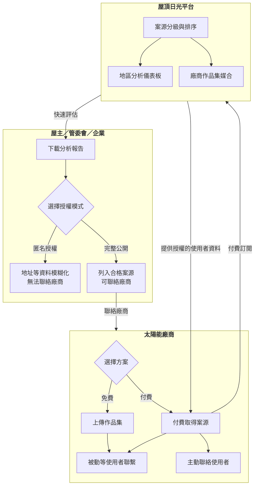

## 平台定位

台灣政府大力推動太陽能政策以增加台灣的電能儲備與能源韌型，這個過程牽扯到太陽能廠商、政府、台電、民眾、企業等不同利害關係人。
評估屋頂是否適合安裝太陽能除了發電量計算以外，也需要考慮投資效益，過往缺乏精準、單棟建物尺度的光電安裝評估工具，評估仰賴大量人力現場作業，
過程對民眾與廠商而言都十分耗時，也成為光電政策推動的一大阻力。因此，**屋頂日光**的目標是建立一個集合評估與媒合服務的太陽光電案源資料平台，
讓民眾可以快速評估自家屋頂是否適合安裝太陽能面板，並進行安裝後的投資試算，以實際效益提升民眾的安裝動機。

平台不靠賣電獲利，而是站在太陽光電產業鏈的前端：協助屋主理解投資潛力，並在取得授權後，將具開發意願的案源整理給廠商與投資者，降低廠商尋找案源與民眾前期評估的成本。

---

## 市場背景

屋頂型光電是台灣目前推動最順利的綠能類型之一。截至 2024 年底，累計建置容量已達 **9 GW**，不僅超過 2025 年預定目標（8 GW），也超越地面型光電（5.28 GW）（[《報導者》](https://www.twreporter.org/a/future-potential-of-rooftop-solar-photovoltaic-system)）。然而與推估潛力相比，實際開發量仍偏低。

經濟部能源署副署長吳志偉向《報導者》表示，依內政部國土管理署的建築物使用執照資料推估，**全國屋頂型光電總潛力超過 27 GW**。

其中，**私有建物**被視為下一波主要成長來源。內政部統計顯示，屋頂面積 1,000 平方公尺（約 302 坪）以下的私有建築，目前光電設置比例僅約 **一成**，能源署認為這塊市場極具推動潛力。政府雖在 2025 年推出「小屋頂獎勵」，但業界普遍認為，比起補助，**簡化評估流程、降低前期勘查成本**才是突破瓶頸的關鍵。

### 接洽失敗：成案率僅 3～5%

《報導者》引述陽光伏特家的實務數據：該公司累計接洽約 **2 萬名**有興趣的屋主，**最終僅 3～5% 成案**。約七成因客觀條件不符而回絕，其餘則為後續失聯、僅來洽詢，或中央／地方承辦規範解讀不一致所致。

| 未成案原因 | 占比 | 說明 |
|------------|-----:|------|
| 建物不合適（如面積不足） | 22% | 屋頂可用面積或結構不符設置門檻 |
| 其他原因（失聯、僅洽詢） | 20% | 屋主意願不確定或後續無法聯繫 |
| 非服務範圍 | 18% | 花東、離島、北北基等區域限制 |
| 鐵皮增建 | 14% | 違建或增建結構無法申設 |
| **房屋遮蔽** | **10%** | 周邊建物或地形遮擋日照 |
| 無產權登記 | 6% | 產權不清，無法推動合約 |
| 規範不一致 | 6% | 中央、地方、承辦人認定標準不同 |
| **成案** | **3～5%** | 最終成功建置 |

### 屋頂日光能解決什麼問題？

在客觀條件回絕的案例中，建物不合適（22%）與房屋遮蔽（10%）合計占近三分之一，這兩項本可在聯繫廠商之前就透過資料分析初步判斷。
屋頂日光希望在接洽階段就幫雙方排除明顯不適合的案場：

| 失敗原因 | 屋頂日光對應功能 |
|----------|------------------|
| **建物不合適** | 自動偵測建物高度與基地面積，估算可裝設屋頂面積與裝置容量 |
| **房屋遮蔽** | 全天屋頂遮蔽動態預覽、遮蔭分析與可用面積比例（usable fraction） |
| 判斷意願 | 使用者選擇授權模式；僅「完整公開」可聯絡廠商 |
| 區域決策 | [地區分析](/guide/region-analysis) 協助廠商判斷服務範圍內的高潛力行政區 |

傳統廠商需投入大量業務拜訪與現場勘查，才能在接洽後才發現屋頂不適合；若案場最後無法成案，前期成本即成為沉沒成本。屋頂日光切入的正是**案場前期評估與案源篩選**——讓屋主在免費評估階段就了解屋頂條件，也讓廠商取得附帶工程與收益資料的合格案源，而非冷名單。

| 痛點 | 傳統做法 | 屋頂日光做法 |
|------|----------|--------------|
| 找案場 | 陌生拜訪、冷名單 | 使用者主動評估，附地址與屋頂條件 |
| 初步評估 | 人工蒐集、現勘試算 | GIS、遮蔭、躉購費率自動試算 |
| 判斷意願 | 多次溝通後才知 | 兩種授權模式；完整公開才可列入案源 |
| 區域決策 | 憑經驗分配業務 | [地區分析](/guide/region-analysis) 排名與熱區 |

---

## 利害關係人互動

平台連結三類主要角色，形成雙邊市場：

  i
  
箭頭表示<strong>服務或資料流向</strong>（由提供方指向接收方）。圖表較大時，請使用右下角的<strong>縮放與方向鍵</strong>瀏覽。

| 角色 | 獲得什麼 | 付出什麼 |
|------|----------|----------|
| **屋主／管委會** | 免費潛力報告、廠商比較、降低資訊落差 | 評估時輸入地址與用電；選擇匿名授權或完整公開 |
| **太陽能廠商（免費）** | 作品集曝光、被動接收使用者詢價 | 入駐審核、維護作品集 |
| **太陽能廠商（付費）** | 授權案源、主動聯絡使用者、地區決策工具 | 案源費、訂閱費或曝光費（付費給平台） |
| **投資者／能源服務商** | 可排序的案場清單、區域潛力與投資組合參考 | SaaS 訂閱或 API 費用 |
| **政府／研究單位** | 行政區級聚合分析（不含個資） | 資料授權或合作專案 |

---

## 收益試算：為什麼需要這個平台？

台灣屋頂光電常見模式是將發電售予台電。115 年度躉購費率依容量分級；以下以「每瓩每年約 1,250 度」簡化估算年售電收入：

| 案場規模 | 適用級距 | 年發電量 | 躉購單價 | 年收入估算 |
|----------|----------|----------|----------|------------|
| 住宅屋頂 | 1–10 kW | 11,250 度 | 5.6279 元/度 | 約 63,314 元 |
| 中小型屋頂 | 10–20 kW | 23,750 度 | 5.3819 元/度 | 約 127,820 元 |
| 商用屋頂 | 20–50 kW | 37,500 度 | 4.2505 元/度 | 約 159,394 元 |
| 工廠屋頂 | 100–500 kW | 125,000 度 | 3.7152 元/度 | 約 464,400 元 |

**舉例：若發電全數賣給台電、用電再向台電購買，是否划算？** 以 9 kW 案場為例，綠色為躉售收入、灰色為同度數購電成本、黃色為兩者差額（簡化淨利空間）：

  
9 kW 住宅 · 年發電 11,250 度

  

    躉售收入
    

      

    

    63,314 元
  

  

    購電成本
    

      

    

    45,900 元
  

  

  

    簡化差額
    

      

    

    17,414 元
  

屋頂光電的商業吸引力來自於 **閒置屋頂資產、再生能源躉購制度與用電價格之間形成的價差空間。** 雖然實際收益仍會受到建置成本、維運費用、併網條件與合約模式影響，並非完全無風險套利，但只要案場的發電收益高於開發與營運成本，屋頂就能從原本未被利用的空間，轉換為具現金流的能源資產。

屋頂日光的角色就是將這個 **潛在套利空間具體化。** 平台透過 GIS、遮蔭分析、發電量估算與收益試算，協助使用者判斷其屋頂是否具備開發價值，也協助廠商與投資者快速篩選出值得進一步現勘與報價的案場。進一步而言，平台可以比較全額躉售、自發自用、屋頂出租與第三方投資分潤等模式，讓各方更清楚理解不同合作方式下的收益分配與投資誘因。

---

### 案源分級

案源依品質分級，對應不同收費模式：

| 案源等級 | 條件 | 收費模式 |
|----------|------|----------|
| 一般案源 | 匿名授權或僅完成查詢 | 低價名單或訂閱制（去識別化摘要） |
| 合格案源 | **完整公開**，且屋頂達基本門檻 | 單筆案源費 |
| 高潛力案源 | 容量、收益、遮蔭與地區條件佳 | 較高單價或競標 |
| 成交案源 | 成功簽約或施工 | 成交抽成或介紹費 |

合格案源比一般廣告名單更有價值，因為同時包含**使用者意願**與**案場條件**兩種資訊。

---

## 總結

屋頂日光的商業價值在於補上太陽光電開發流程中**前期資料評估與案源媒合**的缺口：

- **對使用者**：把複雜投資問題轉成易懂的潛力報告
- **對廠商**：把分散需求轉成可篩選、可排序的合格案源
- **對市場**：讓開發從人力密集的陌生拜訪，轉向資料驅動的精準開發

> **以評估工具作為流量入口，以授權案源作為核心資料資產，以廠商付費、曝光與地區分析作為主要收入，成為屋頂型太陽光電的案源媒合與資料決策平台。**

---

## 參考資料

1. [《報導者》— 9 年綠電「優等生」，新政策再衝刺「屋頂光電」可行嗎？](https://www.twreporter.org/a/future-potential-of-rooftop-solar-photovoltaic-system)（含陽光伏特家接洽數據與能源署潛力推估）
2. [經濟部能源署 — 115 年度再生能源電能躉購費率](https://law.moea.gov.tw/LawContent.aspx?id=GL001913)
3. [經濟部 — 能源推動指標與綠能設置目標](https://www.moea.gov.tw/MNS/populace/news/News.aspx?kind=1&menu_id=40&news_id=122430)
4. [台電 — 各類電價表（114 年 10 月 1 日起）](https://www.taipower.com.tw/media/ba2angqi/%E5%90%84%E9%A1%9E%E9%9B%BB%E5%83%B9%E8%A1%A8%E5%8F%8A%E8%A8%88%E7%AE%97%E7%AF%84%E4%BE%8B.pdf?mediaDL=true)
