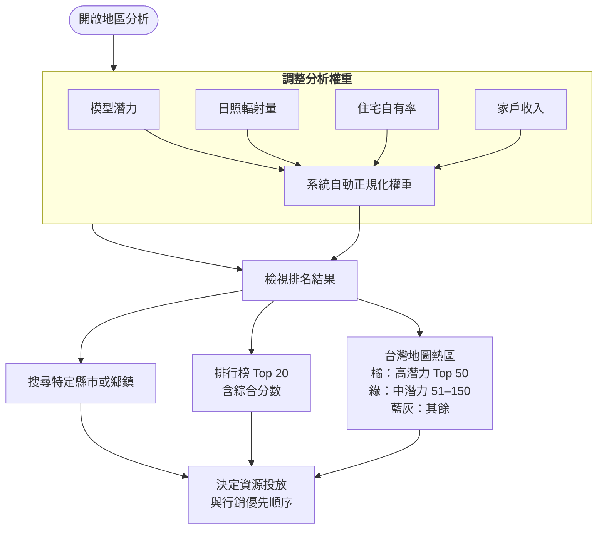

## 適用對象

**地區分析**頁面主要服務：

- **縣市政府**：了解轄內各鄉鎮的太陽能推廣潛力，作為補助或宣導資源配置的參考
- **太陽能廠商**：決定業務拓展與行銷投入的優先行政區

一般屋主若只想評估自家屋頂，請使用首頁的評估流程，無需進入地區分析。

---

## 使用流程

  i
  
圖表較大時，請使用右下角的<strong>縮放與方向鍵</strong>瀏覽。

---

## 排名方法

地區分析結合 **DeepSolar 遷移學習**模型輸出的屋頂潛力，以及 **TOPSIS 多準則決策**方法，對台灣 368 個鄉鎮市區進行綜合排名。

你可透過左側滑桿調整四項指標的相對重要性：

| 指標 | 說明 |
|------|------|
| 模型潛力 | DeepSolar 模型估算的區域屋頂太陽能潛力 |
| 日照輻射量 | 該區年均日照條件 |
| 住宅自有率 | 自有住宅比例，影響戶主裝設意願 |
| 家戶收入 | 區域經濟條件，影響裝設能力 |

調整權重後，地圖與排行榜會即時更新。若需還原預設值，可點選「重設預設值」。

---

## 如何解讀結果

- **高潛力區（橘色）**：綜合分數最高的前 50 個鄉鎮市，適合優先投入推廣資源
- **中潛力區（綠色）**：排名第 51–150 名，具備一定推廣價值
- **一般區（藍灰色）**：其餘行政區

廠商可據此規劃業務拓展順序；政府單位可據此調整各區補助宣導力度。

<Tip>
  地區分析提供的是**區域層級**的推廣參考。個別建物的實際可行性仍須透過地址評估流程，考量建物陰影、屋頂可用面積等細部條件。
</Tip>
