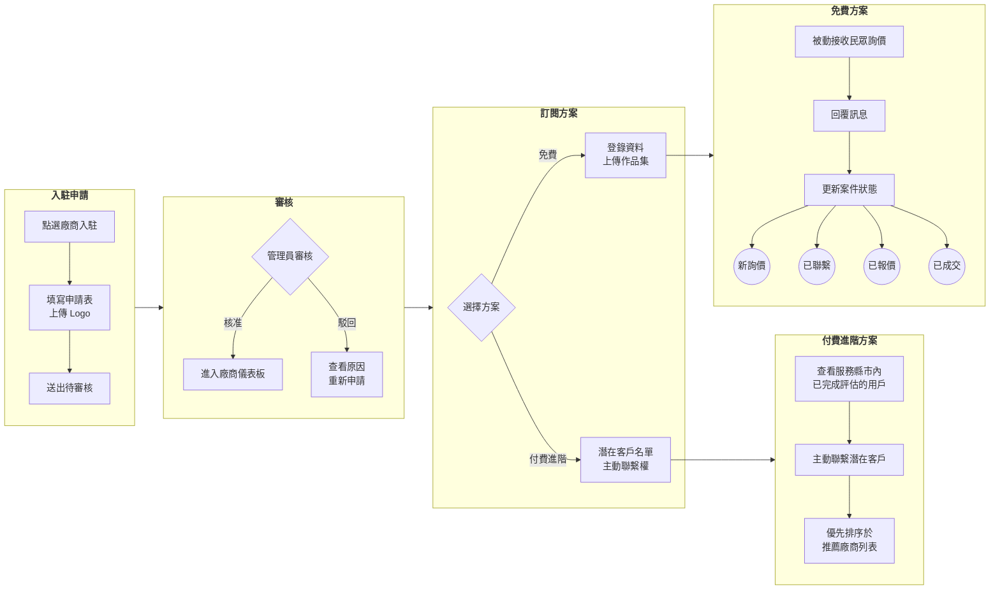

## 什麼是屋頂日光？

**屋頂日光**是台灣屋頂太陽能自助評估服務。你不需要安裝任何軟體——直接在網站上輸入地址，約 5 分鐘即可完成評估，了解屋頂是否適合裝設太陽能、預估能賺多少錢，並下載報告與廠商聯繫。

**立即開始評估**：前往已部署的屋頂日光網站，輸入地址即可開始。不需安裝軟體，也不需註冊就能完成評估。

資料來源包含中央氣象署、台電與能源署等公開資料，並整合各縣市補助資訊。

---

## 民眾評估流程

以下為屋主／一般使用者完成一次評估的完整路徑。圖表由左至右為各步驟。

```mermaid actions={true}
%%{init: {"flowchart": {"nodeSpacing": 28, "rankSpacing": 48, "htmlLabels": true, "subGraphTitleMargin": {"top": 8, "bottom": 14}}}%%
flowchart LR
    subgraph S1["`**Step 1 · 地址**`"]
        direction TB
        A1["輸入台灣地址"] --> A2["自動偵測建物高度<br/>與基地面積"]
        A2 --> A3["調整可裝設屋頂面積"]
        A3 --> A4["全天屋頂遮蔽動態預覽"]
        A3 --> A5["估算全年平均日照"]
    end

    subgraph S2["`**Step 2 · 用電狀況**`"]
        direction TB
        B1["選擇建物類型<br/>獨棟／大樓／營業用"] -->|大樓| B2["輸入住宅戶數"]
        B2 --> B4["戶數x單戶用電估計<br/>大樓總用電量 (kWh)"]
        B1 --> B3["輸入台電帳單金額<br/>或每月用電量 (kWh)"]
    end

    subgraph S3["`**Step 3 · 優化目標**`"]
        direction TB
        C1["選擇發電目標"] --> C2["選擇用電習慣"]
    end

    subgraph S4["`**Step 4 · 參數**`"]
        direction TB
        D1["設定預算上限"] --> D2["選擇面板等級<br/>入門／標準／高效"]
        D2 --> D3["自動帶入縣市補助<br/>試算補助後自付金額"]
    end

    subgraph R["`**評估結果**`"]
        direction TB
        E1["年發電量<br/>能源自給率"] --> E2["回本年限<br/>20 年累計收益"]
        E2 --> E3["最佳安裝角度<br/>月發電圖表"]
        E3 --> E4["下載 PDF 報告"]
        E4 --> E5["聯絡推薦廠商<br/>附上評估報告詢價"]
    end

    S1 --> S2 --> S3 --> S4 --> R
```

  i
  
每個步驟框內由上而下閱讀。圖表較大時，請使用右下角的<strong>縮放與方向鍵</strong>瀏覽。

評估流程不需登入。若註冊帳號，可儲存歷史紀錄、並排比較不同方案，並透過站內訊息聯絡廠商。

---

## 廠商流程

太陽能廠商可入駐平台，依訂閱方案取得不同等級的客戶接觸權限。

  i
  
圖表由左至右為各階段。圖表較大時，請使用右下角的<strong>縮放與方向鍵</strong>瀏覽。

---

## 政府與廠商 · 地區分析

縣市政府與廠商可使用**地區分析**頁面，依台灣 368 個鄉鎮市區評估太陽能推廣潛力與行銷優先順序。詳見 [地區分析](/guide/region-analysis)。

---

## 三種角色一覽

| 角色 | 主要用途 | 是否需要帳號 |
|------|----------|--------------|
| **民眾／屋主** | 評估自家屋頂、試算收益、下載報告、聯絡廠商 | 評估不需；儲存紀錄與詢價需註冊 |
| **太陽能廠商** | 展示作品集、接收／主動聯繫客戶、管理案件 | 需申請入駐並通過審核 |
| **政府／分析人員** | 地區推廣潛力分析、資源與行銷排序 | 地區分析頁面可直接使用 |

---

## 開發者？

若你要在本機執行或貢獻程式碼，請參閱 [開發者指南](/developer-guide/installation)。
